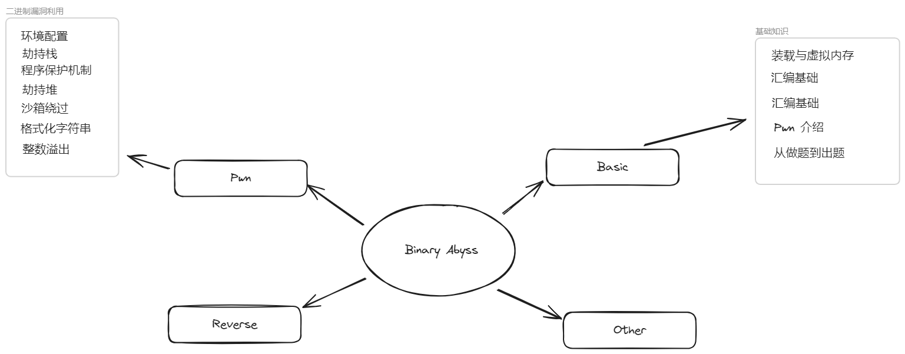

# Binary Abyss / 二进制深渊

## 摘要
这是一个二进制安全系列课程。以 **CTF(Capture The Flag)** 为导向，预计将会包括 **Basic(基础知识)**、 **Pwn(二进制漏洞利用)** 与 **Reverse(逆向工程)** 三部分主要内容以及 **Other(其他内容)**。

> 备注：本项目的课程会按照前后铺垫的顺序陆续发布，对于刚入门的同学，建议按照课程更新顺序查看。
## 目录
### 前言
- [项目介绍](https://www.bilibili.com/video/BV1Fc411X7VX):二进制安全系列课程第0节/前言
- 前置技能
	- C 语言
### 基础知识
- [装载与虚拟内存 / 从 C 语言到二进制](https://www.bilibili.com/video/BV1Yu4y1V74t)
	- 什么是内存、什么是地址
	- 什么是虚拟地址
	- 什么是装载动态库
- [汇编基础 / 从 C 语言到汇编](https://www.bilibili.com/video/BV1GC4y1F7wa)
	- 什么是寄存器
	- 处理器与内存如何进行交互
- [Pwn 介绍 / 目标与手段](https://www.bilibili.com/video/BV1J94y1P76i)
	- 一道常规 Pwn 题该有的信息
	- 如何与题目进行交互 / pwntools
- 从做题到出题 / Pwn 容器搭建与部署
- **暂未施工，等待贡献**
### Pwn
- Pwn 环境配置
	- checksec
	- pwndbg
	- one_gadget
	- ROPgadget
	- IDA
	- pwntools
- 劫持栈
	- ret2text
	- ret2shellcode
	- ret2libc
	- ret2csu
	- 栈迁移 / Stack Pivoting
	- SROP
- 程序保护机制介绍与绕过
	- 金丝雀保护 / Canary Protection
	- PIE / 地址无关代码
	- RELRO / 重定向
	- NX / 内存权限限制
- 劫持堆
	- ptmalloc2 堆管理机制
	- 堆溢出 / Heap Overflow
	- UAF 攻击 / Double Free 攻击
	- Tcache Bin Attack
	- Fast Bin Attack
- 沙箱保护 Seccomp 绕过
	- 黑名单 execve
		- 构造 ROP 绕过
		- 堆上劫持利用 magic gadget
- 格式化字符串漏洞利用
	- 栈上的格式化字符串
	- 堆上的格式化字符串
- 整数溢出漏洞利用
- **暂未施工，等待贡献**
### 逆向工程
- 暂未施工，等待贡献
### 其他内容
- 单字节爆破条件与策略
- 面经
- 杂谈：CTF 与实战到底有什么区别
- [杂谈：我们对 Pwn 都有哪些误解](https://tokameine.top/2023/09/21/%E6%88%91%E4%BB%AC%E5%AF%B9%20PWN%20%E9%83%BD%E6%9C%89%E5%93%AA%E4%BA%9B%E8%AF%AF%E4%BC%9A/)
- 行业前景与职业发展杂谈 / 未来我们能做什么?
- **暂未施工，等待贡献**
## 交流群
QQ：**769251521** 
## 赞助
- 暂未施工QWQ
